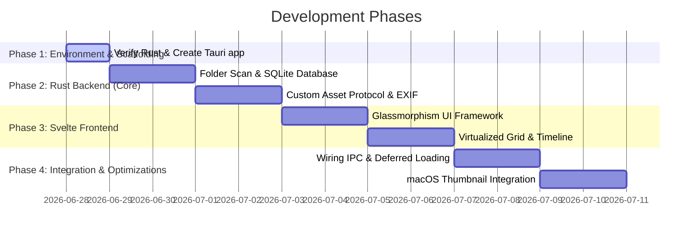

# Implementation Plan: Media Gallery App (Rust / Svelte JS)

This document breaks down the development of our high-performance Media Gallery app into logical, execution-ready phases.

> [!NOTE]
> **Rust Toolchain:** Since Rust is already installed on your system, Phase 1 will focus on verifying that the Rust toolchain (`rustc`, `cargo`) is correctly configured in the shell path (sourcing `~/.cargo/env` if needed).

---

## Phase-by-Phase Breakdown



### Phase 1: Environment Setup & Scaffolding
*Goal: Ensure the development environment is fully prepared and scaffold the Tauri project structure.*
- **Task 1.1:** Verify that `rustc` and `cargo` are available in the PATH. If not, source `~/.cargo/env` or add `~/.cargo/bin` to the shell PATH.
- **Task 1.2:** Scaffold the project in the workspace (`/Users/nitinkumar/Work/MyMediaGallaryApp`) using Bun:
  ```bash
  bunx create-tauri-app --template svelte-js
  ```
- **Task 1.3:** Install NPM dependencies (Vite, Svelte, helper libraries).
- **Task 1.4:** Verify scaffolding by running the app in development mode (`bun run tauri dev`).

---

### Phase 2: Rust Backend (Disk I/O & Caching)
*Goal: Build the engine responsible for high-speed file scanning and database caching.*
- **Task 2.1:** Implement parallel directory scanning in Rust using `jwalk` and `rayon`. Filter files by extension (Images, Videos, Audio).
- **Task 2.2:** Set up a local SQLite database (using `rusqlite`) in the application's data directory. Create tables for:
  - `folders`: Paths to directories selected for scanning.
  - `media`: File path, filename, media type, size, modified date, dimensions, and cached thumbnail path.
- **Task 2.3:** Implement Tauri commands to add/remove directories to scan, read the database, and trigger a scan.
- **Task 2.4:** Write the progressive streaming emitter that batches scanned files and sends them to the frontend via `window.emit()` so the UI populates instantly.

---

### Phase 3: Tauri Custom Protocol & EXIF Extraction
*Goal: Implement safe streaming of local files and rapid thumbnail generation.*
- **Task 3.1:** Register a custom Tauri asset protocol (e.g. `asset://`) to securely stream images/videos directly from external HDDs/SSDs without copying them.
- **Task 3.2:** Implement the EXIF parser in Rust to extract pre-rendered embedded thumbnails from JPEG, RAW, and HEIC files instantly.
- **Task 3.3:** Implement a background resize worker using `image` and `rayon` to scale files down to lightweight WebP thumbnails when no EXIF thumbnail exists. Store them in the app's cache directory.

---

### Phase 4: Svelte Frontend & Glassmorphism UI
*Goal: Build the elegant dark glassmorphic user interface.*
- **Task 4.1:** Establish the styling foundation in `index.css` using elegant translucent colors (`rgba`), high-blur backdrop filters, thin borders, and dark mode palette.
- **Task 4.2:** Create the main layout:
  - Sidebar: Add/remove scanned folders, filter media type (All, Photos, Videos, Audio).
  - Main Window: Title bar, view selector (Day, Month, Year), and the media grid.
- **Task 4.3:** Implement Svelte components for the media viewer modal (Image lightbox with zoom, HTML5 video player, Audio player panel).

---

### Phase 5: Virtualized Grid & Timeline Rendering
*Goal: Implement the core gallery rendering logic with smooth 60 FPS scrolling.*
- **Task 5.1:** Group the media list dynamically by Date (Day, Month, or Year) using standard Svelte reactive statements.
- **Task 5.2:** Implement a virtualized grid in Svelte. It will calculate the viewport size and only render the elements currently visible, recycling DOM nodes during scrolling.
- **Task 5.3:** Integrate `IntersectionObserver` to lazy-load thumbnails as they scroll into view.

---

### Phase 6: Integration, OS Tuning & Polish
*Goal: Connect frontend to backend, integrate macOS QuickLook, and run performance benchmarks.*
- **Task 6.1:** Connect Svelte event listeners to Tauri IPC commands (invoke scan, fetch media database, open native folder picker).
- **Task 6.2:** Integrate macOS native thumbnail bindings (`objc2-quick-look-thumbnailing`) to pull OS-cached thumbnails directly.
- **Task 6.3:** Profile the app using Chrome DevTools performance analyzer. Verify scroll performance remains at a solid 60 FPS under a simulated 10,000+ item workload.

---

## Verification Plan

### Manual Verification
1. Run `bun run tauri dev` and confirm the app opens.
2. Select a folder with 500+ items, check scanning speed, and verify progressive rendering.
3. Scroll rapidly through the grid to confirm frame rate holds at 60 FPS.
4. Play videos, view photos, and test audio playback.
